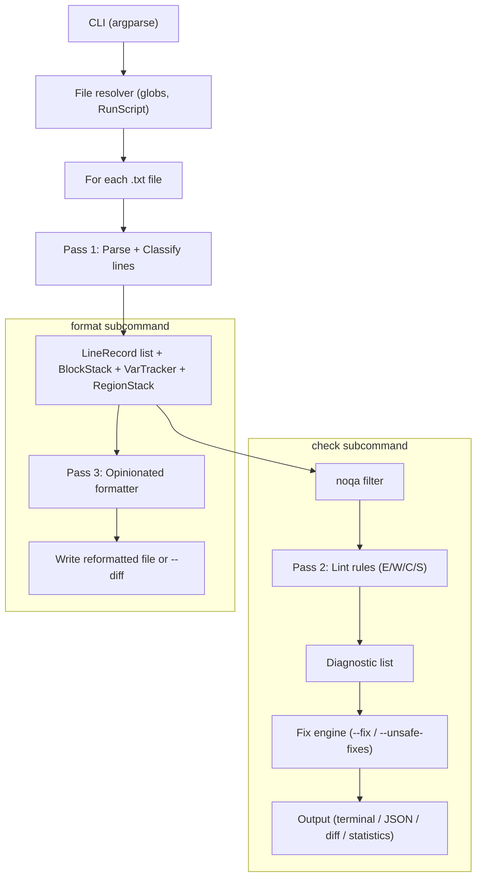

# frida-lint -- Ruff-inspired Linter/Formatter for FRIDA

## Placement and structure

New `tools/` directory at project root, single zero-dependency Python module:

- [tools/frida_lint.py](tools/frida_lint.py) -- the entire tool (stdlib only: `re`, `argparse`, `json`, `dataclasses`, `pathlib`, `sys`, `difflib`, `glob`)
- [.fridalintrc](.fridalintrc) -- optional JSON config at project root
- [.vscode/tasks.json](.vscode/tasks.json) -- Cursor task integration

No external packages. Runs with existing `.venv` or any system Python 3.9+.

## CLI design (Ruff-alike subcommands)

```
frida-lint check <files|globs>                # lint, report diagnostics
frida-lint check <files> --fix                # apply safe auto-fixes
frida-lint check <files> --unsafe-fixes       # apply safe + unsafe fixes
frida-lint check <files> --diff               # preview what --fix would change (implies --fix)
frida-lint check <files> --statistics         # aggregate rule counts
frida-lint check <files> --json               # JSON output
frida-lint check <files> --select E001,W006   # only these rules
frida-lint check <files> --ignore W002,C005   # skip these rules

frida-lint format <files|globs>               # opinionated full reformat
frida-lint format <files> --diff              # show what would change
frida-lint format <files> --check             # exit 1 if would reformat (CI)

Shared flags:
  --config <path>     Path to .fridalintrc (default: auto-discover)
  --no-color          Disable colored output
  --follow-scripts    Also lint files referenced by RunScript
```

`<files>` accepts paths and globs: `Actions.txt`, `*.txt`, `.` (all .txt in cwd).

Invoking as `python tools/frida_lint.py check Actions.txt`.

Note on `--diff`: for the `check` subcommand, `--diff` implies `--fix` (or `--unsafe-fixes` if given). It computes fixes but writes a unified diff to stdout instead of modifying the file. Without `--fix` or `--unsafe-fixes`, `--diff` has no effect. For the `format` subcommand, `--diff` always applies since formatting is unconditional.

## Architecture




Note: `format` does NOT use the noqa filter. Formatting is always applied unconditionally (same as Ruff). `noqa` only suppresses lint diagnostics in the `check` path.

### Pass 1 -- Parse (shared by both subcommands)

Line-by-line tokenizer. Each line produces a `LineRecord`:

```python
@dataclass
class LineRecord:
    line_no: int          # 1-based
    raw: str              # original text
    stripped: str          # .strip() result
    line_type: LineType   # enum: block_open, block_close, region_open, region_close,
                          #       comment, instruction, variable_op, blank
    block_keyword: str    # e.g. "if", "for", "try", "" for non-block lines
    depth: int            # nesting depth at this line (for formatter)
    noqa_codes: set       # inline suppression codes parsed from ## noqa: ...
```

**Block stack**: pushes `(keyword, line_no, expected_closer)` on openers, pops on closers.

- `if`/`else`/`try`/`catch`/`case`/`default` expect `end`
- `for`/`foreach`/`while`/`switch` expect `}`

**Variable tracker**: records declarations (`DefineVariable as "name"`), implicit declarations (`save as "name"`, `save as {name}`, `and save_as name`, loop variables in `foreach item in ...`), usages (`<<<name>>>`, `<<name>>`, `{name}` in instruction context), and global doc entries (`## <<name>>`).

**Region stack**: tracks `#%region NAME` / `#%endregion` pairing.

**RunScript collector**: records any `RunScript <name>` references for `--follow-scripts` resolution.

### Pass 2 -- Lint rules

Each rule is a class with `check(lines, context) -> list[Diagnostic]` and optional `fix(lines, diagnostic) -> list[str]`.

#### Errors (E) -- will cause runtime failure

- **E001** `continue` used -- does not exist in FRIDA. *Unsafe fix*: replace with flag-variable pattern.
- **E002** Bare boolean in `if()` -- `if (<<<var>>>)` without operator. *Safe fix*: rewrite to `if ("<<<var>>>" -eq "true")`.
- **E003** Compound operators in `while` -- `-AND`/`-OR`/`-NOT`/`-XOR`. *Unsafe fix*: restructure into simple while + if/break.
- **E004** Wrong block closer -- `if` closed with `}` or `for` closed with `end`.
- **E005** Unbalanced blocks -- stack not empty at EOF or extra closers.
- **E006** `Throw` used -- does not exist in FRIDA. *Safe fix*: comment out + add FIXME (safe because the line already crashes at runtime; commenting it out cannot make things worse).
- **E007** Multi-line instruction -- a reader instruction (SAP, Excel, Web, etc.) that appears split across lines. Detected heuristically: a line starting with a reader prefix whose parameter pattern is incomplete, followed by a continuation line without its own keyword.
- **E008** `RunScript` references missing file -- file not found in same directory.

#### Warnings (W) -- likely bugs or bad practice

- **W001** Variable used but never declared (exclude globals, loop vars, implicit `save as`).
- **W002** Variable declared but never used.
- **W003** Undocumented global variable -- `<<var>>` used but not listed in the header doc block. *Suppressed automatically if C001 fires* (no doc block at all) to avoid redundant noise; W003 only reports when a doc block exists but is incomplete.
- **W004** `systemnotify`/`SystemNotify` used. *Unsafe fix*: comment out with `## LINT-DISABLED:` (unsafe because it removes runtime behavior).
- **W005** `Finish` inside loop body (should log-and-continue for row-level errors).
- **W006** SAP instruction outside `try`/`catch` (check block stack for enclosing try).
- **W007** Workbook opened but never closed (track `LoadWBook`/`NewWB` vs `Close`/`Save ... and close`).
- **W008** Special characters in `SendMail` (en dash, em dash, smart quotes). *Safe fix*: replace with ASCII equivalents (semantics preserved -- only character encoding changes).
- **W009** No `SAP CloseTrans` in catch block inside a loop (missing transaction recovery).
- **W010** Unmatched `#%region`/`#%endregion` pairs.
- **W011** `Excel ReadCell` result used in SAP instruction without prior empty-check.
- **W012** `SAP SendKey 0` without subsequent `GetStatusInfo` or `RunScript CheckSAPStatus`.
- **W013** `try` block with empty `catch` (silently swallowing errors).
- **W014** String concatenation building up in a loop without bounds (advisory).
- **W015** `Excel Save` never called between successive `Excel Write`/`Append` calls (data loss risk).
- **W016** `DefineVariable type "Date"` used for non-date content.
- **W017** Duplicate `DefineVariable` for the same name without intervening usage between them (copy-paste smell). FRIDA variables are script-global; the second definition silently overwrites. Flagged as suspicious but not a crash.
- **W018** `for 0 times {` -- dead code, loop body never executes. FRIDA handles it gracefully (skips the block) but it is almost certainly a mistake. *Unsafe fix*: comment out the block.

#### Convention (C) -- project standards

- **C001** Missing global variables documentation block at script top. *Safe fix*: auto-generate from all `<<var>>` usages. When C001 fires, W003 is automatically suppressed for the same file to avoid redundant diagnostics.
- **C002** `#%region` without descriptive name.
- **C003** Large block (>30 lines) without any `#%region` marker.
- **C004** No checkpoint comment before `SAP StartTransaction`. *Safe fix*: insert `## Start transaction <tcode>`.
- **C005** Inconsistent variable naming (mixed camelCase / snake_case / PascalCase within same script).
- **C006** Magic number in `for N times` without preceding comment or named variable.
- **C007** `if` immediately followed by opposite `if` on same variable -- should be `if/else`. *Unsafe fix*: merge into if/else. (Not an error because both forms execute correctly; the merged form is cleaner.)
- **C008** `#%region` decorative dashes inconsistent length across script.

#### Style (S) -- formatting issues

- **S001** Inconsistent indentation (expected depth from block stack). *Safe fix*.
- **S002** Comment missing space after `##` (e.g. `##comment`). *Safe fix*. Exception: does NOT flag `#%region`, `#`*, `#?`, `#!` prefixes, which have their own defined syntax.
- **S003** Trailing whitespace. *Safe fix*.

**Relationship between S-rules and the `format` subcommand**: `check --fix` applies S001/S002/S003 surgically -- only at lines where violations are detected. The `format` subcommand performs a full opinionated rewrite that includes these same corrections plus additional normalization (blank lines, region dashes, final newline) that is too aggressive for individual lint fixes. Use `check --fix` for targeted cleanup; use `format` for full canonical formatting.

### Fix engine -- safe vs unsafe

Every fixable rule declares its fix kind:

- **Safe** -- deterministic, cannot change runtime semantics: E002, E006, W008, C001, C004, S001, S002, S003
- **Unsafe** -- changes or removes runtime behavior, or produces large structural rewrites: E001, E003, W004, W018, C007

`--fix` applies only safe fixes. `--unsafe-fixes` applies both safe and unsafe. `--diff` (on `check`) previews fixes without writing.

Rules without a fix (E004, E005, E007, E008, W001-W007 except W004, W009-W017, C002, C003, C005, C006, C008) are report-only.

### noqa inline suppression

Parsed from the end of any line:

```
systemnotify Type "Notification" with message "Done"  ## noqa: W004
```

Block suppression:

```
## noqa-begin: W006
SAP WriteText ElementId wnd[0]/usr/ctxtField Text "<<<val>>>"
SAP SendKey 0
## noqa-end: W006
```

Bare `## noqa` (no code) suppresses all rules for that line.

The parser extracts noqa codes in Pass 1 and the lint pass skips matching diagnostics.

### Pass 3 -- Formatter (`format` subcommand)

Opinionated full-file rewrite, separate from `check --fix`. Applies all of:

- **Indentation**: rewrite to correct block depth (1 tab per level, configurable)
- **Blank lines**: max 2 consecutive; exactly 1 blank before `#%region`, exactly 1 after `#%endregion`
- **Comment spacing**: `##` always followed by a space; `#%`, `#`*, `#?`, `#!` prefixes are left as-is (they have their own syntax)
- **Trailing whitespace**: stripped
- **Region dashes**: normalize `#%region NAME ───...` decorative dashes to consistent 60-char width
- **Final newline**: ensure file ends with exactly one newline

Closer depth rules:

- `end`, `}` reduce depth before applying indent
- `else`, `catch` at same depth as matching `if`/`try`
- `#%region` / `#%endregion` stay at depth 0

### Output modes

**Default terminal** (colored):

```
Actions.txt:136:1: E004 Block mismatch: 'if' closed with '}', expected 'end'
Actions.txt:150:1: W006 SAP WriteText outside try/catch block
Actions.txt:42:1:  S001 Expected indent level 2, found 3 tabs [safe fix]

Found 23 issues (3 errors, 10 warnings, 4 conventions, 6 style)
18 fixable with --fix, 3 additionally fixable with --unsafe-fixes
```

**--statistics**:

```
E002  1  Bare boolean in if() condition      (safe fix)
W001  3  Variable used but never declared
W006  7  SAP instruction outside try/catch
S001  12 Inconsistent indentation            (safe fix)
```

**--json**: array of `{file, line, col, code, message, severity, fixable, fix_kind}`.

**--diff**: unified diff output showing before/after for each applied fix.

**Exit codes**: 0 = clean, 1 = issues found. Both `check` and `format --check` use exit code 1 to signal actionable output (for CI pipelines).

## Config file (`.fridalintrc`)

```json
{
  "indent": "tab",
  "indent_size": 1,
  "select": ["ALL"],
  "ignore": ["W002", "C005"],
  "fixable": ["ALL"],
  "unfixable": [],
  "per-file-ignores": {
    "CheckSAPStatus.txt": ["W006"]
  }
}
```

`select` and `fixable` accept rule codes (e.g. `"E002"`), category prefixes (e.g. `"E"`, `"W"`, `"C"`, `"S"`), or `"ALL"`. Default when omitted: `["ALL"]` (all rules enabled / all fixable rules eligible).

## Cursor integration

[.vscode/tasks.json](.vscode/tasks.json) with four tasks:

- **frida-lint: check** -- `python tools/frida_lint.py check ${file}`
- **frida-lint: fix** -- `python tools/frida_lint.py check ${file} --fix`
- **frida-lint: format** -- `python tools/frida_lint.py format ${file}`
- **frida-lint: diff** -- `python tools/frida_lint.py format ${file} --diff`

Run from Command Palette (Ctrl+Shift+P > "Run Task").

## Key design decisions

- **Zero dependencies** -- stdlib only, runs anywhere Python 3.9+ exists
- **Single file** -- [tools/frida_lint.py](tools/frida_lint.py), portable across FRIDA projects
- **Ruff-alike subcommands** -- `check` (lint + fix) and `format` (rewrite) are separate concerns with shared parsing
- **Safe/unsafe fix split** -- prevents accidental semantic changes; `--fix` is always safe to run, `--unsafe-fixes` opts in to behavior-changing fixes
- **Reader-agnostic instruction detection** -- recognizes instructions by known reader prefixes (`SAP`, `Excel`, `Web`, `File`, `Titanium`, `Word`, `PPT`, `DB`, `Mail`) rather than parsing every instruction variant
- **Variable tracking uses heuristics** -- `save as` / `and save as` / `as {var}` / `save_as` patterns detected via regex to count as implicit declarations, reducing W001 false positives
- **noqa suppression** -- essential escape hatch for real-world scripts; uses FRIDA comment syntax (`## noqa:`); only affects `check`, not `format`
- **W003/C001 deduplication** -- W003 (undocumented global) is suppressed when C001 (no doc block) fires for the same file, avoiding redundant diagnostics
- **Existing [sap-reader/sap_parser.py](sap-reader/sap_parser.py) not reused** -- the linter classifies all line types at a structural level, not instruction execution level

